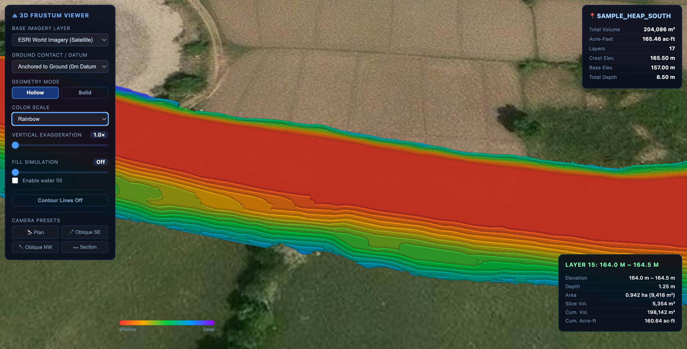
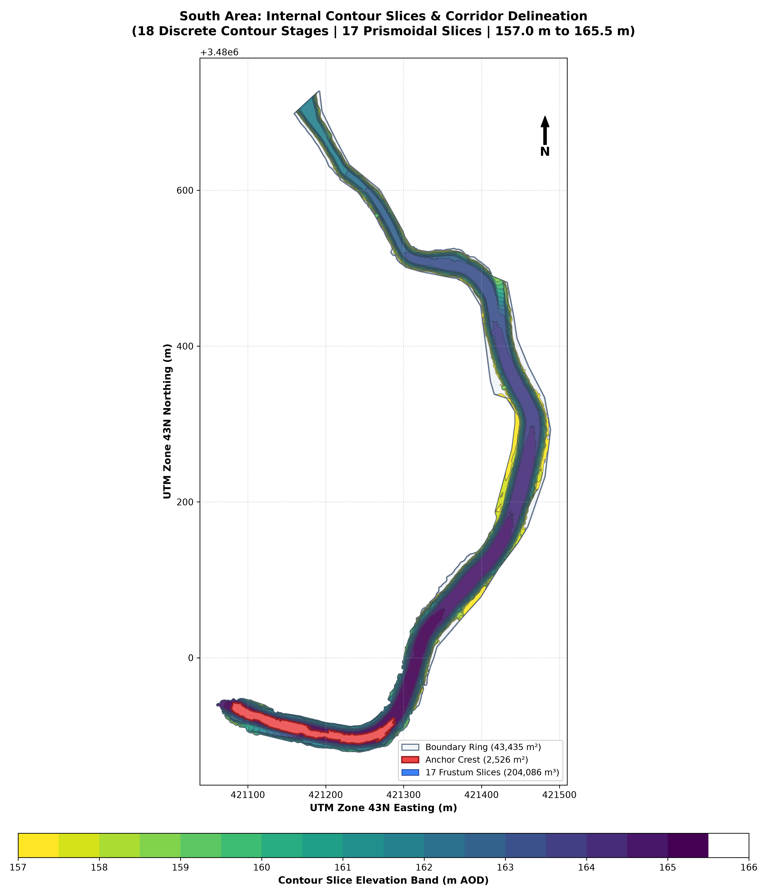
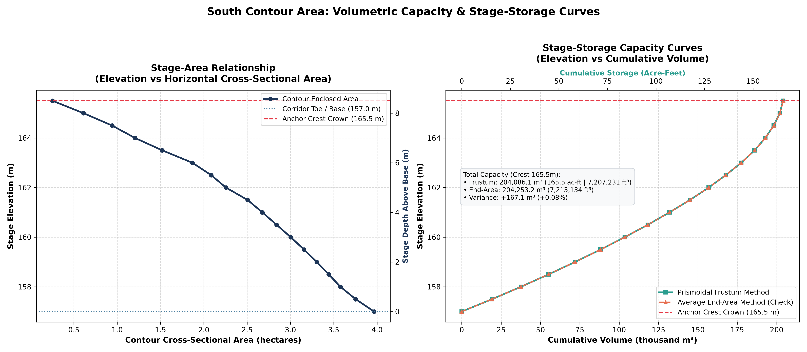
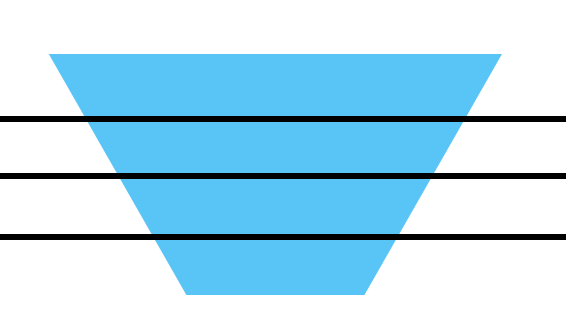

# Frustum Volumetric Analysis & 3D WebGIS Inspection Engine

[](https://github.com/abdulrehmanch/frustum-volumetric-analysis/actions)
[](LICENSE)
[](https://www.python.org/downloads/)
[](https://github.com/astral-sh/ruff)

A high-precision, dataset-agnostic computational geospatial pipeline for multi-layer **Prismoidal Frustum** earthwork volumetric calculations, automated stage-storage curve generation, and interactive **3D CesiumJS WebGIS** digital twin visualizers.

---

## 📸 Visualizations & 3D Digital Twin (South Heap Benchmark)

### Interactive 3D CesiumJS WebGIS Viewer


| 2D Planimetric Slices Map | Dual-Axis Stage-Storage Curves |
| :---: | :---: |
|  |  |

| Conceptual Model | Internal Contour Topology |
| :---: | :---: |
|  |  |

---

## 🧮 Mathematical Foundation

Standard civil engineering approximations often rely on the crude **Average End-Area Method**:

$$V_{\text{end}} = \frac{\Delta h}{2}\left(A_k + A_{k+1}\right)$$

While computationally simple, the Arithmetic Mean-Geometric Mean inequality ($\frac{A_k + A_{k+1}}{2} \ge \sqrt{A_k A_{k+1}}$) proves that the Average End-Area method introduces a **systematic upward volumetric overestimation** whenever terrain side walls taper ($A_k \ne A_{k+1}$).

This engine implements the exact **Prismoidal Frustum Method**:

$$V_{\text{slice}} = \frac{\Delta h}{3}\left(A_k + A_{k+1} + \sqrt{A_k A_{k+1}}\right)$$

Where:
* $A_k$ = Planimetric polygon area of lower stage $k$ ($\text{m}^2$)
* $A_{k+1}$ = Planimetric polygon area of upper stage $k+1$ ($\text{m}^2$)
* $\Delta h$ = Vertical contour interval ($Z_{k+1} - Z_k$ in meters)
* $\sqrt{A_k A_{k+1}}$ = Geometric mean capturing non-linear side-slope wall taper

### Dual-Method Engineering Verification
For every slice stage and cumulative depth, the engine calculates:
* Absolute divergence: $\Delta V = V_{\text{end}} - V_{\text{frustum}}$
* Relative percentage error: $\% \text{ Diff} = \frac{V_{\text{end}} - V_{\text{frustum}}}{V_{\text{frustum}}} \times 100$

---

## ✨ Key Features

1. **Universal Topological Engine (3 Solver Modes):**
   * **`ring` Mode:** Topological ring-snap for closed internal contour rings (e.g. natural depressions, heap stockpiles, retention basins).
   * **`split` Mode:** Boundary-cut planar polygon partitioning for bounded mining concessions.
   * **`band` Mode:** Morphological corridor dilation/erosion for open, unbounded survey lines.
2. **Strict Downward Geometric Nesting:**
   * Enforces spatial containment ($A(Z_k) \ge A(Z_{k+1})$) from crest down to base, guaranteeing monotonic area curves and preventing volumetric fabrication over unsurveyed ground.
3. **Interactive 3D CesiumJS Digital Twin:**
   * Standalone, zero-CORS HTML application with embedded GeoJSON payloads.
   * Dynamic vertical exaggeration slider ($1\times$ to $20\times$), depth colormaps (Bathymetric, Magma, Viridis, Rainbow), animated depth fill simulation, and real-time Heads-Up Display (HUD) telemetry.
4. **Comprehensive Engineering Deliverables:**
   * ESRI Shapefiles for horizontal slices & cumulative solids.
   * Publication-grade dual-axis Stage-Area / Stage-Storage PNG curves.
   * Tabular engineering CSV schedules formatted in $\text{m}^3$, $\text{ft}^3$, and $\text{acre-feet}$.

---

## ⚡ Quickstart

### 1. Installation

```bash
# Clone the repository
git clone https://github.com/abdulrehmanch/frustum-volumetric-analysis.git
cd frustum-volumetric-analysis

# Install with uv (recommended)
uv sync

# Or install with standard pip
pip install -e .
```

### 2. Calculate Volumes on Sample Dataset

```bash
# Run volumetric calculation on the included South heap sample
python scripts/calculate_frustum_volume.py --input examples/sample_heap_south/Contours.shp
```

### 3. Generate 3D CesiumJS Viewer

```bash
# Export Cesium-ready GeoJSON and launch interactive 3D WebGIS viewer
python scripts/export_viewer_data.py --input examples/sample_heap_south/Contours.shp
```

Open `outputs/sample_heap_south/contours_3d_viewer.html` directly in any modern web browser.

---

## 📊 Benchmark Verification (South Heap Sample)

| Metric | Measured Quantity | Unit Equivalent |
| :--- | :--- | :--- |
| **Elevation Range** | $157.0\,\text{m}$ to $165.5\,\text{m}$ | $8.5\,\text{m}$ Total Relief |
| **Base Footprint ($Z=157.0\,\text{m}$)** | $39,652.74\,\text{m}^2$ | $3.97\,\text{ha}$ / $9.80\,\text{acres}$ |
| **Crest Footprint ($Z=165.5\,\text{m}$)** | $2,526.29\,\text{m}^2$ | $0.25\,\text{ha}$ / $0.62\,\text{acres}$ |
| **Total Frustum Volume** | **$204,086.06\,\text{m}^3$** | **$7.21\times 10^6\,\text{ft}^3$ / $165.46\,\text{acre-ft}$** |
| **Average End-Area Volume** | $204,253.20\,\text{m}^3$ | $+167.14\,\text{m}^3$ (+0.08% overestimation) |
| **Divergence Margin** | **0.08%** | Exceptionally tight civil convergence |

---

## 🛠 Command-Line Reference

```bash
python scripts/calculate_frustum_volume.py [OPTIONS] --input PATH_TO_SHAPEFILE
```

### Available Options:
* `--input`, `-i`: Path to input 2D or 3D contour shapefile (`.shp`).
* `--output-dir`, `-o`: Custom directory for outputs (defaults to `outputs/<dataset_name>/`).
* `--site-name`, `-s`: Explicit prefix for output filenames.
* `--mode`, `-m`: Solver mode (`auto`, `ring`, `split`, `band`).
* `--elevation-col`, `-e`: Custom name of the elevation attribute column (auto-detected if omitted).
* `--boundary-col`: Column identifying the boundary feature (for embedded boundaries).
* `--boundary-val`: Value identifying the boundary feature (e.g. `0.0`).
* `--col-map`: Key-value column mapping (e.g. `elevation=Z,geometry=geom`).
* `--close-dist`: Morphological buffer closure distance in meters (default: `25.0`).

---

## 📁 Repository Structure

```
frustum-volumetric-analysis/
├── assets/                          # Tracked figures, 3D screenshots & curves
│   ├── viewer_3d_south_heap.png     # Interactive 3D CesiumJS WebGIS screenshot
│   ├── south_contour_slices_map.png # 2D planimetric slice map
│   └── south_stage_storage_curves.png # Dual-axis stage-storage curve plot
├── docs/                            # Deep-dive engineering guides
│   ├── METHODOLOGY_TECHNICAL.md     # Mathematical & computational formulation
│   ├── METHODOLOGY_SIMPLE.md        # Plain-language methodology guide
│   └── EXPORT_VIEWER_GUIDE.md       # CesiumJS 3D viewer export architecture
├── examples/                        # Sample survey datasets
│   └── sample_heap_south/           # Concentric heap/depression survey shapefile
├── reference_sketches/              # Field diagrams & topological sketches
├── scripts/                         # Core execution engines
│   ├── calculate_frustum_volume.py  # Volumetric calculation & shapefile generator
│   ├── export_viewer_data.py        # 3D CesiumJS GeoJSON exporter
│   ├── viewer/3d_viewer.html        # Standalone CesiumJS WebGIS template
│   └── retired/                     # Legacy site-specific calculation scripts
├── tests/                           # Unit tests & mathematical proof suites
│   └── test_frustum_math.py         # Analytical cone/pyramid & AM-GM proofs
├── pyproject.toml                   # Python packaging & dependency configuration
├── LICENSE                          # MIT License & Engineering Disclaimer
├── CONTRIBUTING.md                  # Contributor guidelines & code standards
├── CODE_OF_CONDUCT.md               # Contributor Covenant v2.1
├── CITATION.cff                     # Academic and surveying citation metadata
└── CHANGELOG.md                     # Release version history
```

---

## 🧪 Running Automated Tests

```bash
# Run mathematical analytical proofs
python3 -m unittest discover tests

# Or with pytest
uv run pytest -v
```

---

## 📄 License & Engineering Disclaimer

This project is licensed under the [MIT License](LICENSE).

> **Disclaimer:** The calculations, volumetric models, geospatial transformations, and 3D visualizers generated by this software are provided strictly for research, computational, and analytical purposes. Earthwork quantities and impoundment capacities should be independently audited and certified by a licensed Professional Surveyor or Registered Professional Engineer prior to use in commercial billing, contractual settlement, or safety-critical construction.
